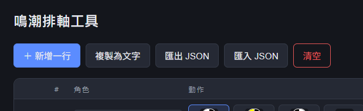
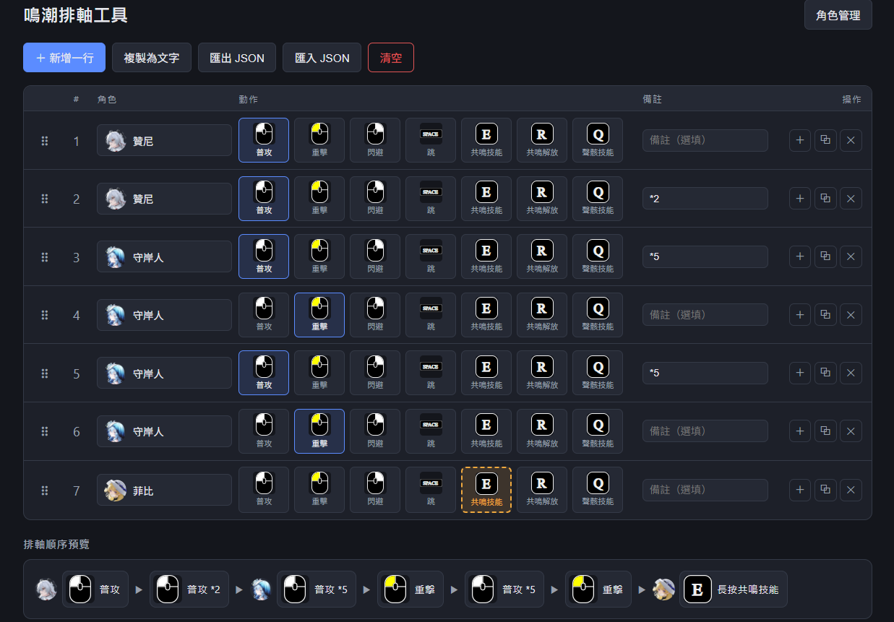
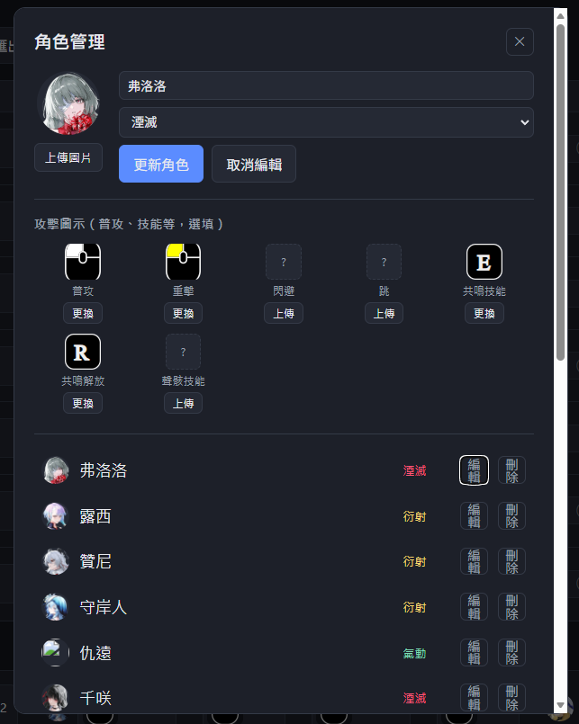

# 鳴潮排軸工具

幫《鳴潮》玩家快速編排、預覽並分享隊伍的技能排軸（Rotation）的網頁小工具。以 Vue 3 + Vite 開發。

## 快速開始

一般使用者最簡單的方式：直接雙擊 [start.bat](start.bat)（背後會呼叫 [start.ps1](start.ps1)）。

- 第一次執行會自動偵測並安裝套件（需先安裝好 [Node.js](https://nodejs.org/)），之後每次執行都會直接啟動。
- 啟動完成後會自動開啟瀏覽器並導向 `http://localhost:5173`。
- 關閉跳出的視窗，或在視窗中按 `Ctrl+C`，即可停止伺服器。

如果要用終端機手動操作（例如要開發、除錯）：

```bash
npm install
npm run dev
```

啟動後依終端機提示開啟瀏覽器網址（預設 `http://localhost:5173`）即可使用。

其他指令：

```bash
npm run build    # 打包正式版到 dist/
npm run preview  # 本地預覽打包結果
```

> 角色頭像上傳功能（角色管理）需要透過 `npm run dev` 啟動的開發伺服器才能寫入圖片檔案，純靜態打包後的版本無法上傳新圖片。

## 功能介紹

### 1. 排軸表



主畫面的表格用來編排你的技能順序，每一列代表一個動作：

- **角色**：點擊角色欄位開啟搜尋選單，輸入名稱篩選、點擊選取角色。
- **動作**：以圖示方塊呈現可選動作（普攻、重擊、閃避、跳、共鳴技能、共鳴解放、聲骸技能），點擊圖示即可選取。
  - **左鍵點擊**：一般選取該動作。
  - **右鍵點擊「共鳴技能」或「共鳴解放」**：標記為「長按」（例如長按共鳴技能），方塊會顯示橘色虛線外框以區分一般選取。
- **備註**：自由輸入文字。若輸入 `*數字`（例如 `*5`），下方「排軸順序預覽」與複製文字的動作名稱後面會自動附加 `*數字`，用來標記同一個動作重複了幾次，例如「普攻 *5」。
- **操作**：
  - `＋`：在該列下方插入新的一列。
  - `⧉`：複製該列內容到下一列。
  - `✕`：刪除該列（若刪到剩 0 列會自動補一列空白列）。
- **拖曳排序**：每列最左側的 `⠿` 把手可直接拖曳調整列順序。

頂部工具列：

- **＋ 新增一行**：在表格最後新增一列。
- **複製為文字**：把整份排軸轉成條列文字並複製到剪貼簿（含角色、動作、備註）。
- **匯出 JSON**：將目前的角色清單與排軸表存成 `rotation-YYYY-MM-DD.json` 檔案下載。
- **匯入 JSON**：讀取先前匯出的 JSON 檔案，還原角色清單與排軸表。
- **清空**：清空整份排軸表（會跳出確認對話框，無法復原）。

### 2. 排軸順序預覽



表格下方會即時顯示已選好角色的動作序列條，以「角色頭像 → 動作圖示／名稱 → 下一個動作」的方式橫向呈現，方便一眼確認整體連招順序。同一角色連續出招時只會在第一個動作顯示頭像，避免畫面雜亂。

上方截圖中可以看到備註欄位打了 `*2`、`*5` 的效果：

- 第 2 列贊尼的普攻備註打 `*2`，預覽列就會顯示「普攻 *2」。
- 第 3、5 列守岸人的普攻備註打 `*5`，預覽列就會顯示「普攻 *5」。
- 第 7 列菲比的共鳴技能用右鍵點選（長按），預覽列會直接顯示「長按共鳴技能」。

換句話說，`* 數字` 是用來標記「這個動作要連續打幾次」的簡寫，不用真的新增好幾列重複的動作，打一個備註就能在預覽／複製文字時自動帶出次數。

### 3. 角色管理



點擊右上角「角色管理」開啟管理視窗：

- **新增 / 編輯角色**：輸入角色名稱、選擇屬性（衍射、氣動、熱熔、冷凝、導電、湮滅、未設定），並可上傳角色頭像圖片。
- **攻擊圖示**：可針對每個角色個別上傳專屬的動作圖示（普攻、重擊、閃避、跳、共鳴技能、共鳴解放、聲骸技能），上傳後會覆蓋預設的通用動作圖示；未上傳則自動使用系統內建的通用圖示（如上方截圖中閃避、跳、聲骸技能還沒上傳，顯示為「?」預留位置）。
- **角色清單**：顯示所有已建立的角色，可個別編輯或刪除。

> 工具預先內建了一批《鳴潮》角色資料（含頭像），首次開啟即可直接使用，不需要手動新增。

### 4. 資料保存

- 角色清單與排軸表都會自動儲存在瀏覽器的 `localStorage`，重新整理頁面或關閉瀏覽器後再開啟都會保留上次的編輯內容。
- 若要在不同裝置 / 瀏覽器間搬移資料，請使用「匯出 JSON」與「匯入 JSON」功能。

## 專案結構簡介

```
src/
  App.vue                  主畫面：排軸表、預覽條、工具列
  components/
    CharacterPicker.vue     角色選擇下拉搜尋元件
    ActionPicker.vue        動作圖示選擇元件（含右鍵長按標記）
    CharacterManager.vue    角色新增 / 編輯 / 刪除管理視窗
  data/
    actions.js              動作清單、可長按動作、通用動作圖示對應
    characterSeed.js         內建角色名稱清單
  storage.js                 localStorage 讀寫
public/
  photo/                     內建角色頭像與動作圖示素材
```
